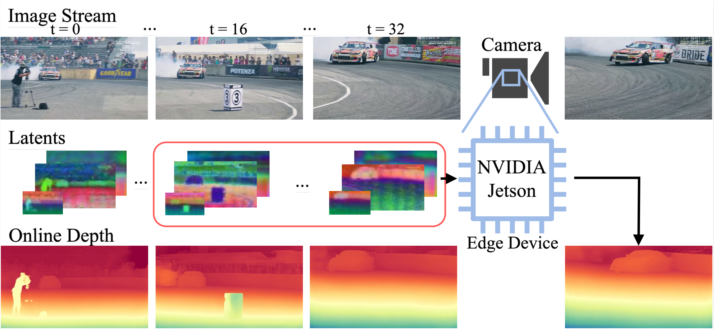
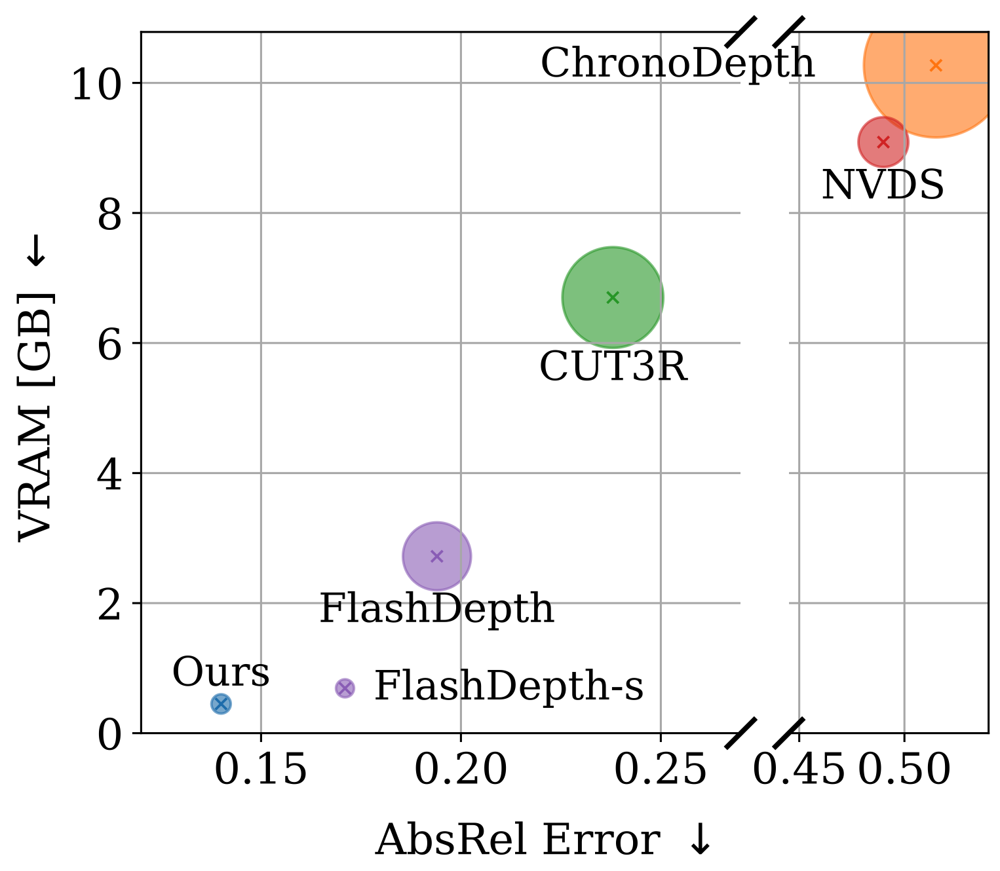

# Online Video Depth Anything: Temporally-Consistent Depth Prediction with Low Memory Consumption</h1>

Original authors:

[**Johann-Friedrich Feiden**](https://scholar.google.com/citations?user=fV6PWhQAAAAJ&hl=de&oi=ao) · [**Tim Küchler**](https://scholar.google.com/citations?user=6Z_CcEsAAAAJ&hl=de&oi=ao) · [**Denis Zavadski**](https://scholar.google.com/citations?user=S7mDg00AAAAJ&hl=de)  · [**Bogdan Savchynskyy**](https://scholar.google.com/citations?hl=de&user=nvycljAAAAAJ)
<br>
[**Carsten Rother**](https://scholar.google.com/citations?user=N_YNMIMAAAAJ&hl=de)
<br>
Heidelberg University, Germany
<br>

<a href="https://arxiv.org/abs/2510.09182"></a>
<a href='https://friedfeid.github.io/oVDA-website/'></a>

### Custom changes:
- converted to python version 3.12, updated pyproject.toml to be used with package managers like uv
- depreciated requirements.txt
- directly using `matplotlib.colormaps["Spectral"]` in [loading_utils.py](./src/utils/loading_utils.py)

### Original Readme are as follows:

We present **Online Video Depth Anything** (oVDA), a model based on [Video Depth Anything](https://videodepthanything.github.io) for predicting detailed, scale- and shift-invariant depth for arbitrary long videos in an online setting, even on edge devices. The key innovation is to employ techniques from Large Language Models (LLMs), namely, caching latent features during inference and masking frames at training. Our oVDA method outperforms all competing online video depth estimation methods in both accuracy and VRAM usage. Low VRAM usage is particularly important for deployment on edge devices. We demonstrate that oVDA runs at 42 FPS on an NVIDIA A100 and at 20 FPS on an NVIDIA Jetson edge device. We will release both, code and compilation scripts, making oVDA easy to deploy on low-power hardware.

 

## News
- **2026-03-09:** Code and model weights released.
- **2025-11-14:** Code and GitHub page are prepared.

## Pre-trained Models
We provide **the smallest model**, based on vits (29.0M parameters), with different cache sizes.
A longer cache size results in slower inference but better overall performance.

| Relative Depth Model | Params | Checkpoint |
|:-|-:|:-:|
| oVDA-small-c16 | 29.0M | [Download](https://huggingface.co/FriedFeid/oVDA/tree/main) |
| oVDA-small-c8 | 29.0M | [Download](https://huggingface.co/FriedFeid/oVDA/tree/main) |


## Usage

### Preparation
Clone the repository
```bash
git clone https://github.com/FriedFeid/OnlineVideoDepthAnything.git
cd OnlineVideoDepthAnything
```
Then create a virtual environment. We propose using Anaconda. It can be installed here: https://www.anaconda.com/docs/getting-started/miniconda/install.
When installed, create a virtual environment: 
```bash
conda create -n oVDA python==3.10
conda activate oVDA
```
We tested our model using Python 3.10 and CUDA version 12.1
```bash
pip install torch==2.4.1 torchvision==0.19.1 numpy==1.26.3 pillow==11.0.0 --index-url https://download.pytorch.org/whl/cu121
```
After that, install the requirements:

```bash
pip install -r requirements.txt
```

If you want to compile the model for your device, you need PyCUDA for building the TensorRT engine.
This can be a tricky installation and is only needed for building the engine. You can install it via `conda install conda-forge::pycuda`. However, we suggest using pip. First, set the environment paths for the compilation to work:
```bash
export CUDA_HOME=/usr/local/cuda
export PATH=$CUDA_HOME/bin:$PATH
export LD_LIBRARY_PATH=$CUDA_HOME/lib64:$LD_LIBRARY_PATH
export PATH=$CUDA_HOME/bin:$PATH
```
Check if the path is correct with:
```bash
ls $CUDA_HOME/include/cuda.h
```
Then install via pip ```pycuda``` and the other dependencies (Note that the versions are dependent on your CUDA version):
```bash
pip install pycuda tensorrt==10.3 tensorrt-cu12-bindings==10.3.0 tensorrt-cu12-libs==10.3.0 onnxscript
```

Download the checkpoints listed [here](#pre-trained-models) and put them under the `checkpoints` directory.

### Run inference on a video
We provide a demo notebook as well as a .py file. Usage:
```bash
python3 run.py --input_video ./assets/example_videos/Cars_and_Gasstation.mp4 --output_dir ./outputs
```
my custom version:
```bash
uv run python run.py --input_video ./assets/example_videos/Cars_and_Gasstation.mp4 --output_dir ./outputs
```

Options:
- `--input_video`: path of input video
- `--input_dir`: directory with multiple input videos
- `--output_dir`: path to save the output results
- `--input_size` (optional): By default, we use input size `518` for model inference.
- `--save_raw` (optional): Saves predictions as a .tiff file.  
- `--device` (default: cuda:0): Sets your CUDA device for model inference.
- `--preprocess_device` (default: cpu): Sets device for preprocessing. 
- `--fp32` (optional): If true, runs the model with FP32 precision
- `--print_process_res` (optional): Prints out the resolution the input video is resized to. 
- `--lazy_forward` (optional): Instead of forwarding the complete video, this forwards frame by frame and writes the new frame directly to disk. Useful if you work with super-long videos. Only works with directories of sorted images.
- `config` (default: ./configs/oVDA_c16.yaml): Load the model corresponding to the config file. 

### Compile model to ONNX graph and TensorRT engine
We provide scripts for translation in `src/build_ONNX/`. Note that you have to rebuild for every engine and resolution you want to use separately.
If you encounter issues using `pycuda`, `onnx`, and `tensorrt`, you can verify your CUDA version by checking the `src/build_ONNX/compile_utils.py` file.

First run:
```bash
python src/build_ONNX/compile_onnx.py
```

This tests and builds a model.onnx in your root directory.
It is tested directly afterwards. Since the .onnx model runs only on the CPU, this might take some time.

When built successfully, you can run:
```bash
python src/build_ONNX/compile_tensorrt.py
```
The building process itself will load the model.onnx and transform it into a .trt engine.
This will also take some time. Afterwards, you can use the accelerated .trt engine.
The script will also test your engine and produce an output image. This should now run on the GPU.
Please note that the testing code is not optimised for runtime. If you plan to use this in a downstream task, please optimise the data preprocessing and loading according to your use case to achieve optimal performance.

## Citation

If you find this project useful, please consider citing:

```bibtex
@misc{feiden2025onlinevideodepthanything,
      title={Online Video Depth Anything: Temporally-Consistent Depth Prediction with Low Memory Consumption}, 
      author={Johann-Friedrich Feiden and Tim Küchler and Denis Zavadski and Bogdan Savchynskyy and Carsten Rother},
      year={2025},
      eprint={2510.09182},
      archivePrefix={arXiv},
      primaryClass={cs.CV},
      url={https://arxiv.org/abs/2510.09182}, 
}
```

## LICENSE
Notice on Mixed Licensing

Parts of this codebase are derived from the Video Depth Anything (VDA) project and are therefore licensed under the Apache License 2.0.
All such portions are explicitly marked in the respective files or code sections.

All remaining components of this repository are licensed under the terms stated in the section “Primary License of This Repository” within the LICENSE file.

Primary License Summary (NC‑SA‑UHDV1.0) 

      ✅ Free use for non‑commercial research, education, and academic work 
      🚫 Commercial use prohibited without written permission 
      🔄 Modifications must use the same license (ShareAlike) 
      🪪 Attribution required: credit Heidelberg University and original authors 
      ⚠️ No warranty; use at your own risk